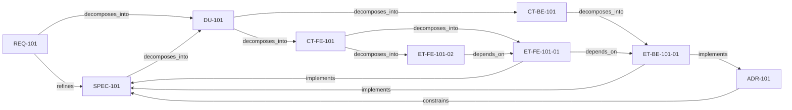

# Sample Traceability Graph

```mermaid
flowchart LR
    REQ101["REQ-101"] -->|refines| SPEC101["SPEC-101"]
    REQ101 -->|decomposes_into| DU101["DU-101"]
    SPEC101 -->|decomposes_into| DU101
    ADR101["ADR-101"] -->|constrains| SPEC101
    DU101 -->|decomposes_into| CTFE101["CT-FE-101"]
    DU101 -->|decomposes_into| CTBE101["CT-BE-101"]
    CTFE101 -->|decomposes_into| ETFE10101["ET-FE-101-01"]
    CTFE101 -->|decomposes_into| ETFE10102["ET-FE-101-02"]
    CTBE101 -->|decomposes_into| ETBE10101["ET-BE-101-01"]
    ETBE10101 -->|implements| SPEC101
    ETBE10101 -->|implements| ADR101
    ETFE10101 -->|depends_on| ETBE10101
    ETFE10101 -->|implements| SPEC101
    ETFE10102 -->|depends_on| ETFE10101
```
